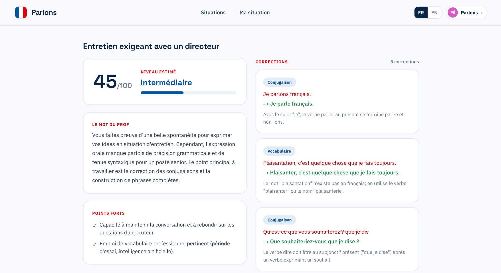

# Parlons — Entraînement au français oral 🇫🇷

> Parlez **à voix haute** avec un avatar en français dans des situations de la vie
> réelle (entretien d'embauche, travail, médecin, préfecture, quotidien). Votre parole
> est transcrite en **temps réel** et **corrigée** : orthographe, grammaire, conjugaison
> et vocabulaire. Entraînement **privé** — pas d'arène, pas de classement.

**🔗 Démo en ligne : [parlons.choubari.com](https://parlons.choubari.com)**



> ⚠️ La démo tourne sur l'offre **gratuite** de Google AI Studio (≈ 20 requêtes/jour et
> par modèle, partagées). La correction en direct peut donc se mettre en pause. Pour un
> usage réel, **hébergez votre propre version** (ci-dessous) avec votre clé.

---

## Fonctionnalités

- **Voix en temps réel** — l'avatar parle et vous répond en français via l'**API Gemini
  Live** (audio natif), avec transcription live, mot à mot, de vous **et** de lui.
- **Correction en direct** — après chaque prise de parole, votre phrase s'affiche
  barrée en rouge → corrigée en vert. Un bouton *Live on/off* permet d'économiser le quota.
- **Rapport de fin de session** — fautes regroupées par type (orthographe, conjugaison,
  grammaire, vocabulaire, syntaxe), points forts, niveau estimé et conseil principal.
- **Situations prêtes à l'emploi** classées par catégorie, **+ vos propres situations**
  décrites à la volée (« Ma situation »).
- **Comptes par lien magique** (sans mot de passe, e-mail via Resend). En local, le lien
  s'affiche dans la console serveur — aucun e-mail requis.
- **Suivi privé** de vos sessions et de vos fautes les plus fréquentes.
- **Thème drapeau français** (bleu `#0055A4` / blanc / rouge `#E1000F`).

## Pile technique

| Couche         | Techno                                                             |
| -------------- | ------------------------------------------------------------------ |
| Framework      | Next.js (App Router) + React 19                                    |
| Hébergement    | Cloudflare Workers via [OpenNext](https://opennext.js.org/cloudflare) |
| Base de données| Cloudflare **D1** (SQLite)                                         |
| Stockage       | Cloudflare **R2** (avatars, optionnel)                             |
| IA             | Google **Gemini** — Live (voix) + Flash (correction)              |
| E-mail         | **Resend** (liens magiques)                                        |
| Style          | Tailwind v4                                                        |

---

## Démarrage en local

Prérequis : Node 20+, une clé **Google AI Studio** (gratuite) et — en option — une clé
**Resend**.

```bash
git clone https://github.com/choubari/parlons-francais.git
cd parlons-francais
npm install
cp .env.example .env.local     # renseignez au minimum GEMINI_API_KEY et ADMIN_EMAIL
npm run db:migrate             # applique le schéma sur la base D1 locale
npm run dev                    # http://localhost:3000
```

**Connexion en local** : sans `RESEND_API_KEY`, aucun e-mail n'est envoyé — le lien
magique s'affiche directement dans la **console du serveur**. Copiez-le dans le
navigateur pour vous connecter. Le compte dont l'e-mail vaut `ADMIN_EMAIL` devient admin
et possède les situations intégrées.

Obtenez une clé Gemini gratuite : https://aistudio.google.com/apikey

---

## Auto-hébergement sur Cloudflare

### 1. Connectez Wrangler

```bash
npx wrangler login
```

### 2. Créez les ressources (une seule fois)

```bash
# Base D1 — copiez le database_id renvoyé dans wrangler.toml
npx wrangler d1 create parlons

# Bucket R2 pour les avatars (optionnel — sinon avatars à initiales)
npx wrangler r2 bucket create parlons-avatars
```

Puis ouvrez **`wrangler.toml`** et renseignez :

- `database_id` (celui renvoyé ci-dessus) ;
- le `pattern` du domaine sous `routes` (ou supprimez `routes` pour n'utiliser que
  l'URL `*.workers.dev`) ;
- `APP_URL` = l'origine publique déployée.

### 3. Déclarez les secrets

```bash
npx wrangler secret put GEMINI_API_KEY   # clé Google AI Studio
npx wrangler secret put RESEND_API_KEY   # clé Resend (envoi des e-mails)
npx wrangler secret put ADMIN_EMAIL      # e-mail admin (situations intégrées)
npx wrangler secret put AUTH_SECRET      # chaîne aléatoire 32+ caractères
```

### 4. Migrez + déployez

```bash
npm run db:migrate:remote      # applique le schéma sur la base D1 distante
npm run deploy                 # build OpenNext + déploiement Workers
```

Votre instance est en ligne. Pour un domaine personnalisé, laissez `routes` dans
`wrangler.toml` : Wrangler provisionne l'enregistrement DNS et le certificat TLS.

---

## Variables d'environnement

| Variable             | Requis | Rôle                                                            |
| -------------------- | :----: | --------------------------------------------------------------- |
| `GEMINI_API_KEY`     |   ✅   | Clé Google AI Studio (avatar live + correction). Serveur.       |
| `ADMIN_EMAIL`        |   ✅   | Compte admin, propriétaire des situations intégrées.            |
| `RESEND_API_KEY`     |   ◻︎   | Envoi des liens magiques. Absent → lien affiché en console.     |
| `RESEND_FROM`        |   ◻︎   | Expéditeur vérifié (ex. `Parlons <parlons@mail.exemple.com>`).  |
| `APP_URL`            |   ◻︎   | Origine publique (callbacks des liens magiques, prod).          |
| `AUTH_SECRET`        |   ◻︎   | Chaîne aléatoire 32+ caractères (réservé).                      |
| `GEMINI_LIVE_MODEL`  |   ◻︎   | Modèle voix live (défaut sensé).                                |
| `GEMINI_JUDGE_MODEL` |   ◻︎   | Modèle de correction (ex. `gemini-flash-latest`).               |

En local, mettez-les dans `.env.local`. En production Cloudflare, `GEMINI_API_KEY`,
`RESEND_API_KEY`, `ADMIN_EMAIL` et `AUTH_SECRET` sont des **secrets Worker**
(`wrangler secret put`) ; `APP_URL` et `RESEND_FROM` sont dans `[vars]` de `wrangler.toml`.

## À propos des quotas Gemini

L'offre gratuite de Google AI Studio limite fortement le nombre de requêtes par jour et
par modèle. L'app en tient compte : les corrections en direct sont **throttlées** (une à
la fois), se **mettent en pause** automatiquement en cas de dépassement (le rapport final
reste disponible), et les appels **réessaient** puis basculent sur un modèle de secours.
Pour un usage régulier, **activez la facturation** sur votre projet Google AI Studio.

## Confidentialité

L'audio du micro est transmis directement du navigateur à l'API Gemini Live ; il n'est ni
enregistré ni stocké. Les situations personnalisées ne servent qu'à construire la
conversation en cours. L'historique de sessions est conservé pour votre compte.

## Licence

MIT — voir [`LICENSE`](./LICENSE).

---

Forké depuis « Closer » (cold-call-trainer) et adapté à l'apprentissage du français oral.
Construit avec [Claude Code](https://claude.com/claude-code).
